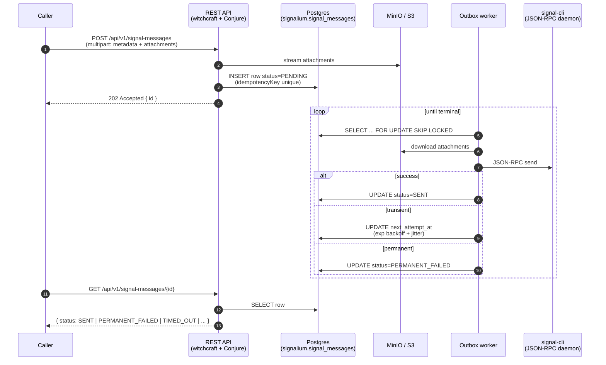

# go-signalium

A Go service for sending outbound [Signal](https://signal.org/) messages over HTTP. Callers `POST` a message (optionally with attachments) and poll for terminal delivery status; the service drives a [`signal-cli`](https://github.com/AsamK/signal-cli) daemon over JSON-RPC and persists every state transition in Postgres.

[](https://go.dev/)
[](./LICENSE)
[](https://github.com/olehmushka/go-signalium/actions/workflows/ci.yml)
[](https://github.com/olehmushka/go-signalium/actions/workflows/codeql.yml)
[](https://codecov.io/gh/olehmushka/go-signalium)
[](https://goreportcard.com/report/github.com/olehmushka/go-signalium)
[](https://github.com/olehmushka/go-signalium/releases/latest)

---

## What this demonstrates

A small but production-shaped Go service, built on Palantir's open-source stack, that exercises the patterns that matter for reliable backend systems:

- **Durable async delivery via the outbox pattern** — `POST` persists a `PENDING` row and returns `202`; a background worker drains it. Claiming uses `FOR UPDATE SKIP LOCKED` with a per-row **lease**, exponential backoff + jitter, and a complete, auto-enforced state machine (`PENDING → SENDING → SENT | FAILED | PERMANENT_FAILED | TIMED_OUT`).
- **Honest distributed-systems reasoning** — at-least-once send semantics, the duplicate-send window and how it's bounded, and crash/partition recovery are all reasoned through in ADRs ([0011](./docs/decisions/0011-exactly-once-send.md)), not hand-waved.
- **Operability built in** — a `signalium.outbox.*` metric family (send latency, backlog depth/age, terminal-status rates) on witchcraft's registry, an automatic timeout reaper, and structured `werror`/`wlog` logging throughout. See [`docs/observability.md`](./docs/observability.md).
- **Mastery of the Palantir Go stack** — witchcraft-go-server, Conjure IDL, `wlog`/`werror`, fx owning the lifecycle, with the framework inversion documented in [ADR 0005](./docs/decisions/0005-fx-wrapping-witchcraft.md).
- **A real engineering bar** — typed sqlc query layer, Atlas migrations, hermetic unit + testcontainers integration + fuzz tests run with `-race`, strict `golangci-lint`, CodeQL/govulncheck, and signed releases with SBOMs.

For the full narrative — the decisions, tradeoffs, and failure reasoning — read [`docs/design.md`](./docs/design.md). Every non-trivial decision also has an [ADR](./docs/decisions).

## How a message flows



## What it does

- **REST in.** `POST /api/v1/signal-messages` accepts a `multipart/form-data` body (`metadata` JSON part + zero or more `attachments` file parts). Attachments stream straight to MinIO; the message is persisted as a `PENDING` outbox row and the response is `202` immediately.
- **Outbox out.** A goroutine claims `PENDING` rows with `FOR UPDATE SKIP LOCKED`, downloads attachments to the `signal-cli` daemon's local disk, issues a JSON-RPC `send`, and marks the row `SENT` (or schedules a retry with exponential backoff + jitter).
- **Polling for status.** Callers loop `GET /api/v1/signal-messages/{id}` until `status ∈ {SENT, PERMANENT_FAILED, TIMED_OUT}`. No webhooks, no callbacks, no message broker.
- **Idempotency.** Sends carrying an `idempotencyKey` short-circuit to the prior message id on retry.
- **Deadlines.** A message with `timeoutSeconds` is excluded from the claim once overdue and reaped to `TIMED_OUT`, instead of being retried to `PERMANENT_FAILED`.
- **Metrics.** A `signalium.outbox.*` family (send/claim latency, backlog depth/age, terminal-status and retry counters) is emitted on witchcraft's registry — no extra scrape endpoint.
- **Optional inbound capture.** When `signalCli.enableListening=true`, received Signal events are deduplicated and persisted to `signalium.inbound_signal_messages` for downstream consumers.
- **Optional Slack alerts.** Permanent failures fan out to Slack when configured.

## Stack

| Concern | Choice | Why |
|---|---|---|
| HTTP server | [witchcraft-go-server](https://github.com/palantir/witchcraft-go-server) | Free health/readiness/metrics, request-scoped logging, IDL-driven handlers. ADR [0004](./docs/decisions/0004-witchcraft-full-framework.md). |
| API IDL | [Conjure](https://github.com/palantir/conjure-go) | Single source of truth for types, errors, and handler signatures. |
| DI / lifecycle | [uber-go/fx](https://pkg.go.dev/go.uber.org/fx) | Owns `main` and the process lifecycle; witchcraft is a managed component. ADR [0005](./docs/decisions/0005-fx-wrapping-witchcraft.md). |
| DB | Postgres + [pgx/v5](https://github.com/jackc/pgx) + [sqlc](https://sqlc.dev/) | Typed query layer. |
| Migrations | [Atlas](https://atlasgo.io/) (versioned SQL) | Migrate-lint in CI; advisory-locked auto-run at boot. ADR [0007](./docs/decisions/0007-atlas-for-migrations.md). |
| Object storage | [MinIO](https://min.io/) (S3-compatible) | Local for dev; swap to S3 in prod by config alone. |
| Logging / errors | [`wlog` / `werror`](https://github.com/palantir/witchcraft-go-logging) | Structured logs, stack-bearing errors. |
| Signal protocol | [signal-cli](https://github.com/AsamK/signal-cli) (Java daemon) | TCP JSON-RPC for sends + receive stream; HTTP for groups proxy. |

## Quick start

Requirements: Docker + `go 1.26` (only needed for `make run` / `make test`; the production binary ships in a container).

```bash
# 1. Bring up dependencies
docker compose -f deploy/docker-compose.yml up -d postgres minio signal-cli

# 2. Link signal-cli to a Signal account (first boot only).
#    Scan the printed QR code from the linked phone:
docker compose -f deploy/docker-compose.yml logs -f signal-cli

# 3. Apply migrations (auto-run is on by default at server start, but you can
#    apply them explicitly for sanity):
docker exec -it <container_name_or_id> psql -U <user> -d <database_name> -c "CREATE SCHEMA IF NOT EXISTS signalium;"
make migrate-up

# 4. Run the service
make run
```

Submit a message:

```bash
curl \
  -sk \
  -F 'metadata={"externalId":"my-msg-1","groupId":"<group ID>","content":"hi"};type=application/json' \
  http://localhost:8083/api/v1/signal-messages  | jq
```

get groups:
```bash
curl -sk https://localhost:8083/api/v1/groups | jq
```

Poll for terminal status:

```bash
curl http://localhost:8083/api/v1/signal-messages/<id>
```

See [`docs/rest-api.md`](./docs/rest-api.md) for the full endpoint list and error model.

## Repository layout

```
go-signalium/
├── cmd/go-signalium/        # fx.New(...).Run() — only place with a main()
├── conjure/                 # Conjure IDL (single source of truth for types & errors)
├── internal/
│   ├── config/              # install.yml + runtime.yml — typed configuration
│   ├── db/                  # pgx pool, advisory-locked migration runner
│   ├── domain/              # plain Go types shared across layers
│   ├── handler/             # HTTP/Conjure handlers + raw multipart endpoint
│   ├── repo/                # sqlc wrapper (Messages, Inbound)
│   │   ├── queries/         # .sql query files
│   │   └── sqlc/            # generated; never hand-edit
│   ├── service/             # business logic (Send, Slack, InboundListener, ...)
│   ├── signal/              # signal-cli TCP + HTTP clients + fake daemon
│   ├── storage/             # MinIO client + bucket bootstrap
│   ├── worker/              # outbox worker + cron cleanup
│   ├── server/              # witchcraft.Server provider + lifecycle hook
│   └── generated/           # conjure-go output; never hand-edit
├── migrations/              # Atlas versioned SQL + atlas.sum (embedded into the binary)
├── deploy/                  # Dockerfile.signal-cli + docker-compose.yml
├── var/conf/                # default install.yml + runtime.yml
└── docs/                    # design docs + ADRs (start at architecture.md)
```

## Documentation

| Doc | When to read it |
|---|---|
| [`docs/design.md`](./docs/design.md) | The narrative deep-dive: decisions, tradeoffs, failure reasoning. **Start here.** |
| [`docs/architecture.md`](./docs/architecture.md) | Big picture, fx wiring, request lifecycle. |
| [`docs/rest-api.md`](./docs/rest-api.md) | All endpoints, response envelope, error model, Conjure pointer. |
| [`docs/persistence.md`](./docs/persistence.md) | Schema, sqlc layout, Atlas migrations, `search_path` gotcha. |
| [`docs/signal-cli.md`](./docs/signal-cli.md) | TCP JSON-RPC + HTTP integration, reconnect, event demux. |
| [`docs/attachments.md`](./docs/attachments.md) | Multipart parsing, MinIO bucket layout, TTL cleanup. |
| [`docs/worker.md`](./docs/worker.md) | Outbox semantics, lease, backoff, claim query, timeout reaper. |
| [`docs/observability.md`](./docs/observability.md) | The `signalium.outbox.*` metric catalogue, tags, and how to read them. |
| [`docs/inbound-listening.md`](./docs/inbound-listening.md) | How received Signal messages are captured. |
| [`docs/config.md`](./docs/config.md) | Every install + runtime knob. |
| [`docs/style.md`](./docs/style.md) | Palantir Go conventions encoded as rules; `.golangci.yml` rationale. |
| [`docs/decisions/`](./docs/decisions) | Architectural decision records (ADRs). |

## Development

```bash
make help              # list all targets
make build             # compile ./bin/go-signalium
make run               # go run ./cmd/go-signalium
make test              # hermetic unit tests (-race)
make integration-test  # full Postgres testcontainer suite (Docker required, ~90s)
make lint              # golangci-lint
make fmt               # gofumpt + goimports
make sqlc-generate     # regenerate internal/repo/sqlc from queries + migrations
make conjure           # regenerate internal/generated from the Conjure IDL
make migrate-up        # apply pending migrations against the local DB
make migrate-diff NAME=add_foo
```

The hermetic suite has no external dependencies; the integration suite spins a Postgres container via [testcontainers-go](https://golang.testcontainers.org/).

## Contributing

See [CONTRIBUTING.md](./CONTRIBUTING.md). Short version: open an issue first for non-trivial changes, branch as `feature/...` / `bug/...` / `refactor/...`, `make lint && make test` is the merge bar, behavioural changes get an ADR in `docs/decisions/`.

## Security

See [SECURITY.md](./SECURITY.md) for the disclosure process.

## License

Apache-2.0. See [LICENSE](./LICENSE).
